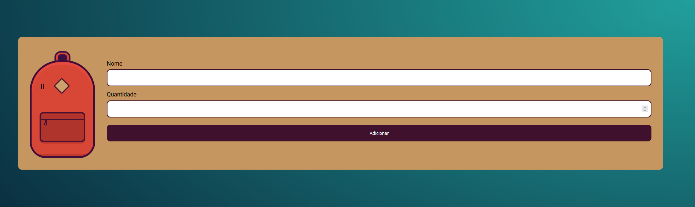

<h1 align="center"> Mochila pra Viagem </h1>

Mochila pra Viagem - Um site para auxiliar na organização e lembrar dos item para por na mochila quando for viajar. 

  

 

## 🚀 Tecnologias

Esse projeto foi desenvolvido com as seguintes tecnologias:

- HTML
- CSS
- JavaScript
- Git e Github

## 💻 Projeto

O projeto Mochila pra Viagem visa ampliar os conhecimentos de JavaScript referente a manipulação do DOM e armazenamento de dados no localStorage, assim o usuario poderá inserir e remove os itens, além de poder recarregar o site sem perder os dados fornecidos, pois estará salvo na memoria do navegador do usuário.

- [Visite o projeto online](https://mathfrlima.github.io/Alura-mochila-pra-viagem/)

